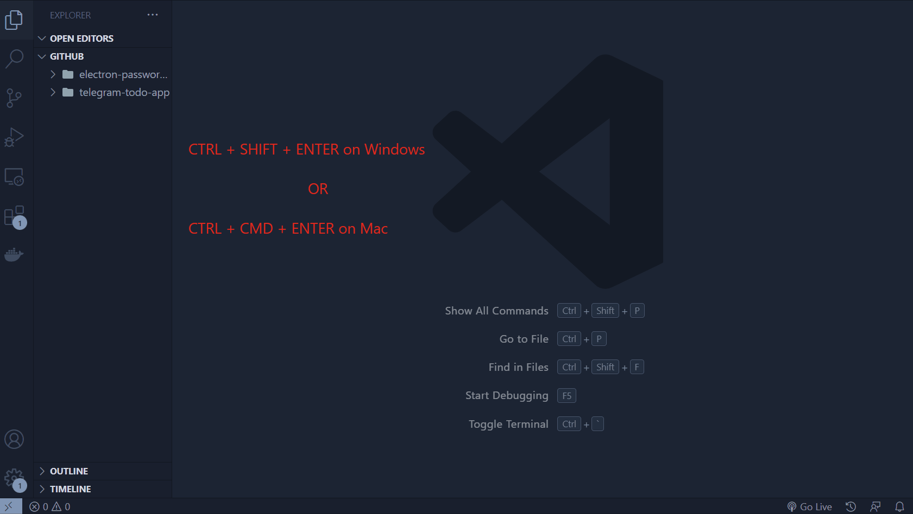

  <div align="center">
     
  </div>
  
  <h1 align="center"> VS Code - Git Commit Wizard</h1>
  
 <div align="center">
  
</div>
<br/>
  
  <div align="center">
     <a href="https://marketplace.visualstudio.com/items?itemName=andrii-bohdan.git-commit-wizard" alt="Marketplace"></a>
     <a href="https://open-vsx.org/extension/andrii-bohdan/git-commit-wizard" alt="Open Eclipse"></a>
     <a href="https://open-vsx.org/extension/andrii-bohdan/git-commit-wizard" alt="Open VSX"></a>
  </div>
  
  <br/>
  <div align="center">
    <a href="https://marketplace.visualstudio.com/items?itemName=andrii-bohdan.git-commit-wizard">Installation</a> ·
    <a href="https://github.com/andrii-bohdan/vscode-git-commit-wizard#description">Description</a> ·
    <a href="https://github.com/andrii-bohdan/vscode-git-commit-wizard#features">Feature</a> ·
    <a href="https://github.com/andrii-bohdan/vscode-git-commit-wizard#requirements">Requirements</a> ·
    <a href="https://github.com/andrii-bohdan/vscode-git-commit-wizard#extension-settings">Extension Settings</a> ·
    <a href="https://github.com/andrii-bohdan/vscode-git-commit-wizard#keyboard-shortcut"> Keyboard Shortcut</a>    
  </div>
  
 
   
  
<h2>Description</h2>

This extension helps users write well-structured commit messages, making it easier to maintain and manage changes to code repositories. With its versatility, it can be used across multiple repositories in source control trees, enabling users to maintain a consistent approach to commit message formatting across their projects.



<h2>Features</h2>

- Provides the process of writing a well-structured commit message.
- Allows you to select a commit type from a predefined list based on the package.json file.
- Allows you to enter a commit scope and message to complete the commit message in the standard format.
- Allows working with microservices
- Compatibility with VSCodium

<h2> Requirements</h2>

Please ensure that the Git extension is enabled in your VS Code environment.

<h2> Extension Settings</h2>

This extension contributes the following settings:

`git-commit-wizard.enable`: Enable/disable this extension.

`git-commit-wizard.showIconsInSCMTitle`: Enable/disable the visibility of icons in the SCM title.

`git-commit-wizard.showStatusBarIcon`: Enable/disable the visibility of status bar.

`git-commit-wizard.showEmojis`: Enable/Disable the visibility of emojis.

`git-commit-wizard.commitTemplate`:

An array of strings representing the commit message template. The following placeholders can be used:

- `{prefix}`: The commit message prefix.
- `{scope}`: The commit message scope.
- `{message}`: The commit message message.

Example:

```
{
  "git-commit-wizard.commitTemplate": [
    "{prefix}({scope}): {message}"
  ]
}

```

`git-commit-wizard.autofillCommits`:

An object containing default values for the commit message fields. The following properties can be used:

- `scope`: An array of objects with label and value properties.
- `message`: An array of objects with label and value properties.

Example:

```
{
  "git-commit-wizard.autofillCommits": {
    "scope": [
      {
        "key": "feat",
        "value": "my-new-feature"
      }
    ],
    "message": [
      {
        "key": "feat",
        "value": "Add a new feature"
      }
    ]
  }
}

```

`git-commit-wizard.inputSettings`:

An object containing default options for the commit message prompt. The following properties can be used:

- `repository`: An object with title and placeholder properties.
- `prefix`: An object with title and placeholder properties.
- `scope`: An object with title and placeholder properties.
- `message`: An object with title and placeholder properties.

Example:

```
{
  "git-commit-wizard.inputSettings": {
    "repository": {
      "title": "Repository",
      "placeholder": "Select a repository from the list (use arrow keys to navigate)"
    },
    "prefix": {
      "title": "Prefix",
      "placeholder": ""
    },
    "scope": {
      "title": "Scope",
      "placeholder": ""
    },
    "message": {
      "title": "Message",
      "placeholder": ""
    }
  }
}

```

`git-commit-wizard.commitOptions`:

An object containing a list of commit message prefixes. Each prefix is represented by an array of objects with label and detail properties.

Example:

```
{
  "git-commit-wizard.commitOptions": {
    "prefix": [
      {
        "label": "feat",
        "detail": "A new feature"
      },
      {
        "label": "fix",
        "detail": "A bug fix"
      },
      {
        "label": "docs",
        "detail": "Documentation changes"
      }
    ]
  }
}

```

`git-commit-wizard.enableSpellCheck`: Enable/Disable spell checking.

`git-commit-wizard.spellCheckLocale`:

An object containing a list of spell check locales. Each locales is represented by an array of string.

Example:

```
{
  "git-commit-wizard.spellCheckLocale": {
    "type": "string",
    "default": "en-US",
    "description": "Locale for spell checking",
    "enum": [
      "en-US",
      "it-IT",
      "fr-FR",
      "es-ES"
    ],
    "enumDescriptions": [
      "English (United States)",
      "Italian (Italy)",
      "French (France)",
      "Spanish (Spain)"
    ]
  },
}

```

`git-commit-wizard.skippedWords`:

An object containing a list of skipped words. The skipped words is represented by an array of string.

Example:

```
{
  "git-commit-wizard.skippedWords": {
    "type": "array",
    "default": [],
    "description": "Words to be skipped by the spellchecker",
    "items": {
      "type": "string"
    }
  }
}

```

<h2> Keyboard Shortcut </h2>

This extension also includes a keyboard shortcut to quickly open the commit message scaffold. Use the following shortcut to activate it:

- **Windows / Linux:** `Ctrl+Shift+Enter`
- **macOS:** `Cmd+Shift+Enter`

